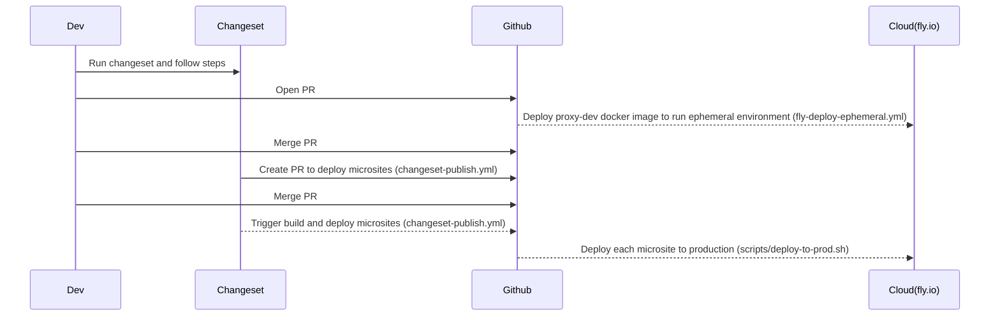

## Microsites monorepo
This is an example of a monorepo that contains multiple microsites. 
Each microsite is a separate project that can be built and deployed independently. 

The main goal of this repository is to demonstrate how to manage multiple microsites in a monorepo. 

### Structure

In the microsites folder, you can find three microsite: admin, homepage and login.

Each microsite define same taks:
- dev: start a development server for the specific microsite
- build: build the specific microsite

The cool thing is that under packages/proxy-dev we defined a proxy server that will serve the microsites like a single application.
It "simulates" a monolithic application that contains all the microsites.

In the main package.json we defined:
- dev: start the proxy server and all the microsites in development mode
- build: build all the microsites

### Versioning and publishing
To version each single microsite we are using *changesets*. 
When you want to release a new version of a microsite you have to run `npm run changeset` and follow the instructions.

After opened a new PR, the CI will run the tests and build the microsites. 
Through this GHA *fly-deploy-ephemeral.yml* we will deploy the microsites to a temporary URL and you can check if everything is ok.
Will deploy the microsites to a temporary URL means that we will deploy the proxy server and all the microsites to a temporary URL.

When the PR is merged, changesets will create a new Pull Request with the new version of the microsite.
When the PR is merged, the CI will run the tests and build the microsites.

sequenceDiagram
participant Dev as Developer
participant Changeset as Changeset
participant ProxyDev as Proxy (packages/proxy-dev)
participant Ephemeral as Ephemeral Environment
participant CI_CD as CI/CD Pipeline

